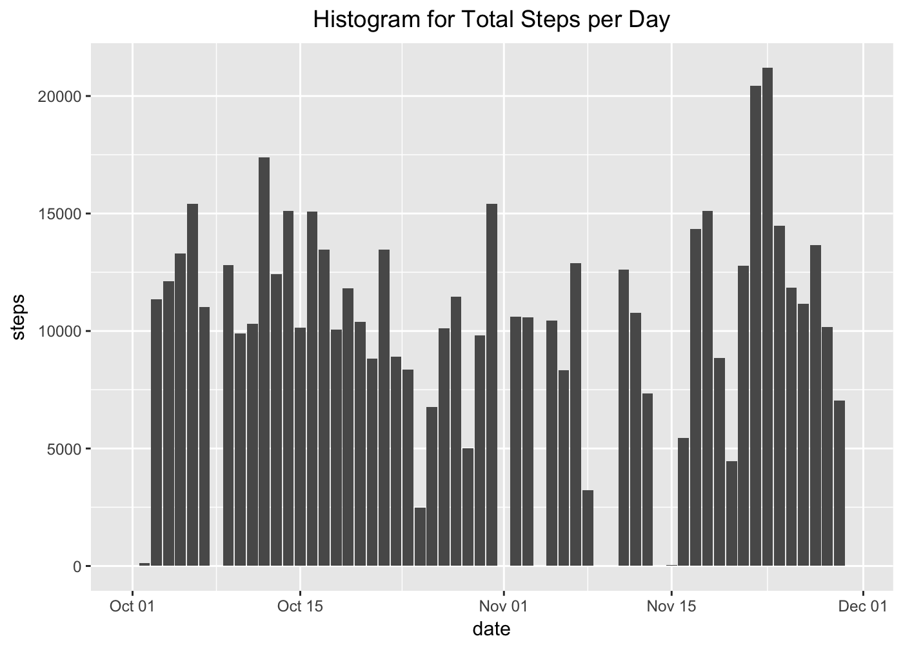
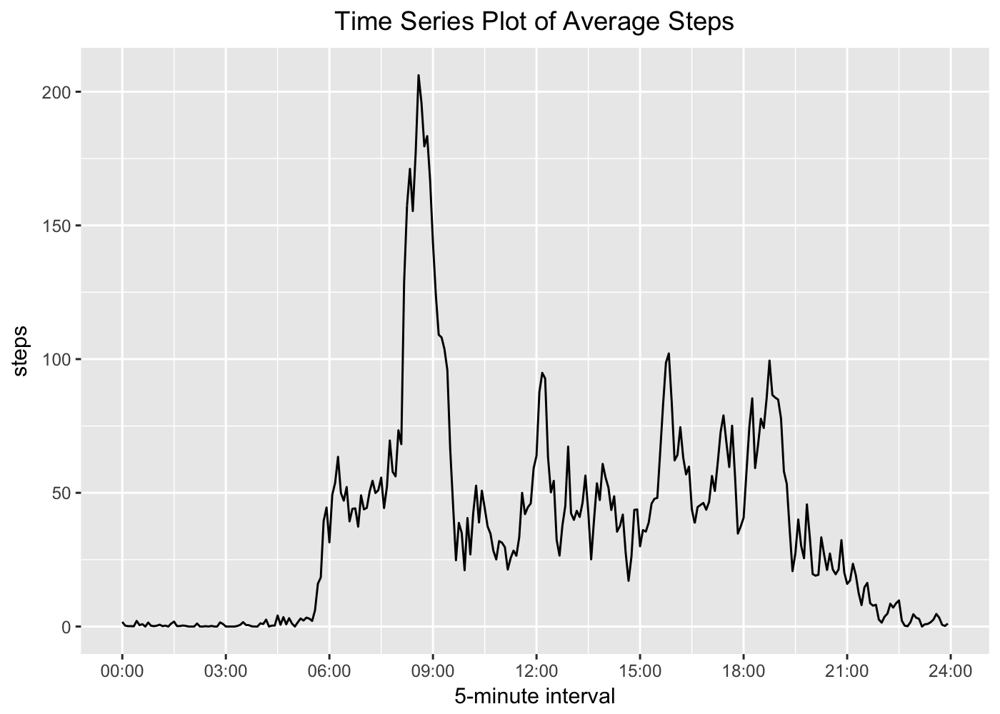
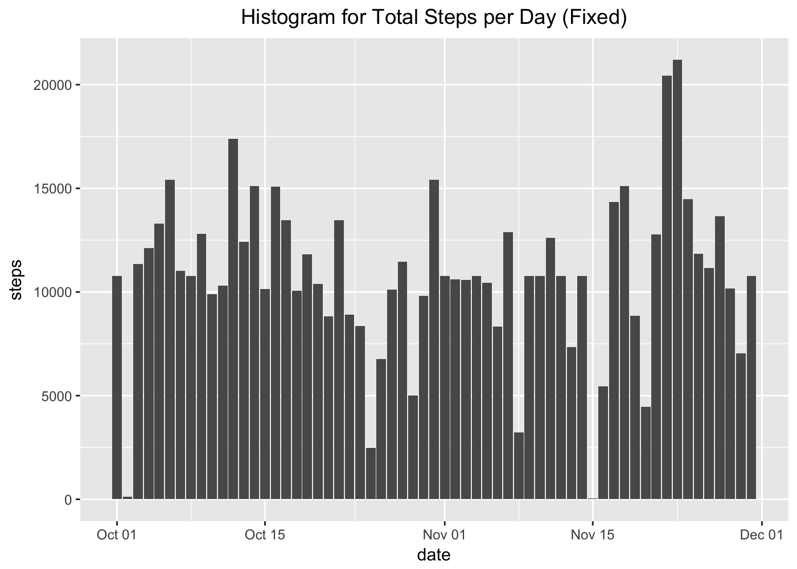
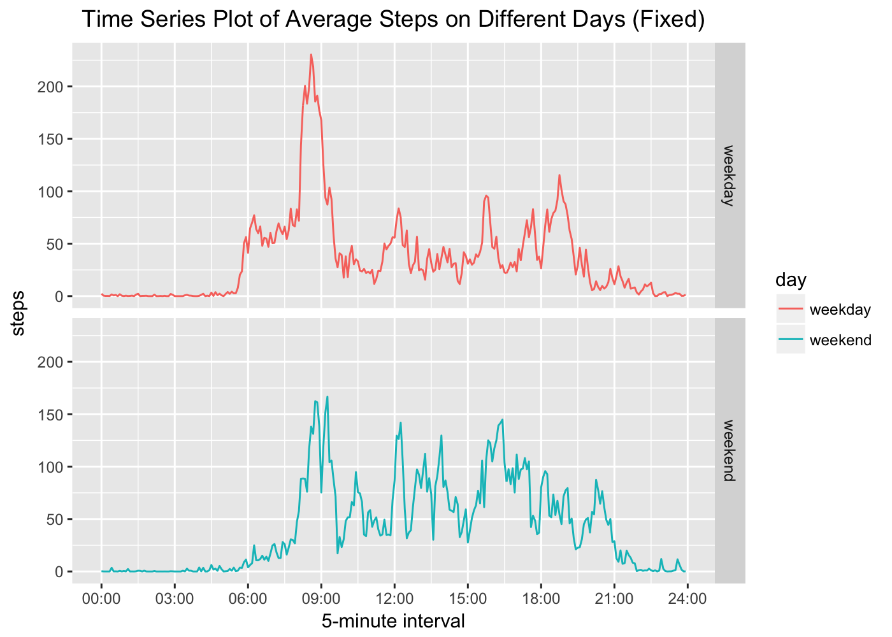

# Reproducible Research: Peer Assessment 1

## Setting global options

```r
library(knitr)
library(kableExtra)
opts_chunk$set(echo = T, dpi = 200)
options(knitr.table.format = "html") 
```

## Define a display function to help us show the table more elegantly

```r
display <- function(t){
  kable(t, align = 'c') %>%
  kable_styling(bootstrap_options = c("striped", "hover", "condensed"))
}
```

## Loading and preprocessing the data

### 1. Unzip activity.zip

```r
zipfile <- "activity.zip"
unzip(zipfile, exdir = ".")
datapath <- "activity.csv"
```

### 2. Load the data

```r
library(readr)
library(dplyr)
library(printr)
df <- read_csv(datapath)
display(head(df, 10))
```

<table class="table table-striped table-hover table-condensed" style="margin-left: auto; margin-right: auto;">
<thead><tr>
<th style="text-align:center;"> steps </th>
   <th style="text-align:center;"> date </th>
   <th style="text-align:center;"> interval </th>
  </tr></thead>
<tbody>
<tr>
<td style="text-align:center;"> NA </td>
   <td style="text-align:center;"> 2012-10-01 </td>
   <td style="text-align:center;"> 0 </td>
  </tr>
<tr>
<td style="text-align:center;"> NA </td>
   <td style="text-align:center;"> 2012-10-01 </td>
   <td style="text-align:center;"> 5 </td>
  </tr>
<tr>
<td style="text-align:center;"> NA </td>
   <td style="text-align:center;"> 2012-10-01 </td>
   <td style="text-align:center;"> 10 </td>
  </tr>
<tr>
<td style="text-align:center;"> NA </td>
   <td style="text-align:center;"> 2012-10-01 </td>
   <td style="text-align:center;"> 15 </td>
  </tr>
<tr>
<td style="text-align:center;"> NA </td>
   <td style="text-align:center;"> 2012-10-01 </td>
   <td style="text-align:center;"> 20 </td>
  </tr>
<tr>
<td style="text-align:center;"> NA </td>
   <td style="text-align:center;"> 2012-10-01 </td>
   <td style="text-align:center;"> 25 </td>
  </tr>
<tr>
<td style="text-align:center;"> NA </td>
   <td style="text-align:center;"> 2012-10-01 </td>
   <td style="text-align:center;"> 30 </td>
  </tr>
<tr>
<td style="text-align:center;"> NA </td>
   <td style="text-align:center;"> 2012-10-01 </td>
   <td style="text-align:center;"> 35 </td>
  </tr>
<tr>
<td style="text-align:center;"> NA </td>
   <td style="text-align:center;"> 2012-10-01 </td>
   <td style="text-align:center;"> 40 </td>
  </tr>
<tr>
<td style="text-align:center;"> NA </td>
   <td style="text-align:center;"> 2012-10-01 </td>
   <td style="text-align:center;"> 45 </td>
  </tr>
</tbody>
</table>

## What is mean total number of steps taken per day?

### 1. Calculate the total number of steps per day

```r
daydf <- df %>%
  group_by(date) %>%
  summarise(steps = sum(steps, na.rm = T))
display(head(daydf, 10))
```

<table class="table table-striped table-hover table-condensed" style="margin-left: auto; margin-right: auto;">
<thead><tr>
<th style="text-align:center;"> date </th>
   <th style="text-align:center;"> steps </th>
  </tr></thead>
<tbody>
<tr>
<td style="text-align:center;"> 2012-10-01 </td>
   <td style="text-align:center;"> 0 </td>
  </tr>
<tr>
<td style="text-align:center;"> 2012-10-02 </td>
   <td style="text-align:center;"> 126 </td>
  </tr>
<tr>
<td style="text-align:center;"> 2012-10-03 </td>
   <td style="text-align:center;"> 11352 </td>
  </tr>
<tr>
<td style="text-align:center;"> 2012-10-04 </td>
   <td style="text-align:center;"> 12116 </td>
  </tr>
<tr>
<td style="text-align:center;"> 2012-10-05 </td>
   <td style="text-align:center;"> 13294 </td>
  </tr>
<tr>
<td style="text-align:center;"> 2012-10-06 </td>
   <td style="text-align:center;"> 15420 </td>
  </tr>
<tr>
<td style="text-align:center;"> 2012-10-07 </td>
   <td style="text-align:center;"> 11015 </td>
  </tr>
<tr>
<td style="text-align:center;"> 2012-10-08 </td>
   <td style="text-align:center;"> 0 </td>
  </tr>
<tr>
<td style="text-align:center;"> 2012-10-09 </td>
   <td style="text-align:center;"> 12811 </td>
  </tr>
<tr>
<td style="text-align:center;"> 2012-10-10 </td>
   <td style="text-align:center;"> 9900 </td>
  </tr>
</tbody>
</table>

### 2. Make a histogram for the total steps per day

```r
library(ggplot2)
ggplot(daydf, aes(x = date, y = steps)) +
  geom_histogram(bins = 20, stat = "identity") +
  ggtitle("Histogram for Total Steps per Day") +
  theme(plot.title = element_text(hjust = 0.5))
```

<!-- -->

### 3. Calculate the mean and median of the total steps per day

```r
result <- daydf %>%
  summarise(mean = mean(steps), median = median(steps))
display(result)
```

<table class="table table-striped table-hover table-condensed" style="margin-left: auto; margin-right: auto;">
<thead><tr>
<th style="text-align:center;"> mean </th>
   <th style="text-align:center;"> median </th>
  </tr></thead>
<tbody><tr>
<td style="text-align:center;"> 9354.23 </td>
   <td style="text-align:center;"> 10395 </td>
  </tr></tbody>
</table>

## What is the average daily activity pattern?

### 1. Calculate the average steps for each time interval

```r
timedf <- df %>%
  group_by(interval) %>%
  summarise(steps = mean(steps, na.rm = T)) %>%
  mutate(minutes = interval %/% 100 * 60 + interval %% 100) %>%
  select(-steps, steps)
display(head(timedf, 10))
```

<table class="table table-striped table-hover table-condensed" style="margin-left: auto; margin-right: auto;">
<thead><tr>
<th style="text-align:center;"> interval </th>
   <th style="text-align:center;"> minutes </th>
   <th style="text-align:center;"> steps </th>
  </tr></thead>
<tbody>
<tr>
<td style="text-align:center;"> 0 </td>
   <td style="text-align:center;"> 0 </td>
   <td style="text-align:center;"> 1.7169811 </td>
  </tr>
<tr>
<td style="text-align:center;"> 5 </td>
   <td style="text-align:center;"> 5 </td>
   <td style="text-align:center;"> 0.3396226 </td>
  </tr>
<tr>
<td style="text-align:center;"> 10 </td>
   <td style="text-align:center;"> 10 </td>
   <td style="text-align:center;"> 0.1320755 </td>
  </tr>
<tr>
<td style="text-align:center;"> 15 </td>
   <td style="text-align:center;"> 15 </td>
   <td style="text-align:center;"> 0.1509434 </td>
  </tr>
<tr>
<td style="text-align:center;"> 20 </td>
   <td style="text-align:center;"> 20 </td>
   <td style="text-align:center;"> 0.0754717 </td>
  </tr>
<tr>
<td style="text-align:center;"> 25 </td>
   <td style="text-align:center;"> 25 </td>
   <td style="text-align:center;"> 2.0943396 </td>
  </tr>
<tr>
<td style="text-align:center;"> 30 </td>
   <td style="text-align:center;"> 30 </td>
   <td style="text-align:center;"> 0.5283019 </td>
  </tr>
<tr>
<td style="text-align:center;"> 35 </td>
   <td style="text-align:center;"> 35 </td>
   <td style="text-align:center;"> 0.8679245 </td>
  </tr>
<tr>
<td style="text-align:center;"> 40 </td>
   <td style="text-align:center;"> 40 </td>
   <td style="text-align:center;"> 0.0000000 </td>
  </tr>
<tr>
<td style="text-align:center;"> 45 </td>
   <td style="text-align:center;"> 45 </td>
   <td style="text-align:center;"> 1.4716981 </td>
  </tr>
</tbody>
</table>

### 2. Make a time series plot

```r
# Define a function that can transform interval into a label to help us plot
interval_to_label <- function(x){
  paste(formatC(x %/% 60, width = 2, flag = "0"), 
        formatC(x %% 60, width = 2, flag = "0"), 
        sep = ":")
}
ggplot(timedf, aes(x = minutes, y = steps)) +
  geom_line() +
  ggtitle("Time Series Plot of Average Steps") +
  theme(plot.title = element_text(hjust = 0.5)) +
  xlab("5-minute interval") +
  scale_x_continuous(breaks = seq(0, 1440, 180), labels = interval_to_label)
```

<!-- -->

### 3. Find the interval that contains the maximum average steps

```r
result <- timedf %>%
  top_n(n = 1)
display(result)
```

<table class="table table-striped table-hover table-condensed" style="margin-left: auto; margin-right: auto;">
<thead><tr>
<th style="text-align:center;"> interval </th>
   <th style="text-align:center;"> minutes </th>
   <th style="text-align:center;"> steps </th>
  </tr></thead>
<tbody><tr>
<td style="text-align:center;"> 835 </td>
   <td style="text-align:center;"> 515 </td>
   <td style="text-align:center;"> 206.1698 </td>
  </tr></tbody>
</table>

## Imputing missing values

### 1. Calculate the total number of missing values in the dataset

```r
result <- summarise_all(df, function(x){sum(is.na(x))})
display(result)
```

<table class="table table-striped table-hover table-condensed" style="margin-left: auto; margin-right: auto;">
<thead><tr>
<th style="text-align:center;"> steps </th>
   <th style="text-align:center;"> date </th>
   <th style="text-align:center;"> interval </th>
  </tr></thead>
<tbody><tr>
<td style="text-align:center;"> 2304 </td>
   <td style="text-align:center;"> 0 </td>
   <td style="text-align:center;"> 0 </td>
  </tr></tbody>
</table>

Now, we can see that only the steps column has missing values. Therefore, there are **2304 rows with NAs** in the dataset.

### 2. Fill in all the missing values with mean for 5-minute interval

```r
fixeddf <- df %>%
  group_by(date, interval) %>%
  mutate(steps = if_else(is.na(steps), timedf$steps[which(timedf$interval == interval)], as.double(steps)))
display(head(fixeddf, 10))
```

<table class="table table-striped table-hover table-condensed" style="margin-left: auto; margin-right: auto;">
<thead><tr>
<th style="text-align:center;"> steps </th>
   <th style="text-align:center;"> date </th>
   <th style="text-align:center;"> interval </th>
  </tr></thead>
<tbody>
<tr>
<td style="text-align:center;"> 1.7169811 </td>
   <td style="text-align:center;"> 2012-10-01 </td>
   <td style="text-align:center;"> 0 </td>
  </tr>
<tr>
<td style="text-align:center;"> 0.3396226 </td>
   <td style="text-align:center;"> 2012-10-01 </td>
   <td style="text-align:center;"> 5 </td>
  </tr>
<tr>
<td style="text-align:center;"> 0.1320755 </td>
   <td style="text-align:center;"> 2012-10-01 </td>
   <td style="text-align:center;"> 10 </td>
  </tr>
<tr>
<td style="text-align:center;"> 0.1509434 </td>
   <td style="text-align:center;"> 2012-10-01 </td>
   <td style="text-align:center;"> 15 </td>
  </tr>
<tr>
<td style="text-align:center;"> 0.0754717 </td>
   <td style="text-align:center;"> 2012-10-01 </td>
   <td style="text-align:center;"> 20 </td>
  </tr>
<tr>
<td style="text-align:center;"> 2.0943396 </td>
   <td style="text-align:center;"> 2012-10-01 </td>
   <td style="text-align:center;"> 25 </td>
  </tr>
<tr>
<td style="text-align:center;"> 0.5283019 </td>
   <td style="text-align:center;"> 2012-10-01 </td>
   <td style="text-align:center;"> 30 </td>
  </tr>
<tr>
<td style="text-align:center;"> 0.8679245 </td>
   <td style="text-align:center;"> 2012-10-01 </td>
   <td style="text-align:center;"> 35 </td>
  </tr>
<tr>
<td style="text-align:center;"> 0.0000000 </td>
   <td style="text-align:center;"> 2012-10-01 </td>
   <td style="text-align:center;"> 40 </td>
  </tr>
<tr>
<td style="text-align:center;"> 1.4716981 </td>
   <td style="text-align:center;"> 2012-10-01 </td>
   <td style="text-align:center;"> 45 </td>
  </tr>
</tbody>
</table>

### 3. Calculate the total number of steps per day

```r
fixeddaydf <- fixeddf %>%
  group_by(date) %>%
  summarise(steps = sum(steps, na.rm = T))
display(head(fixeddaydf, 10))
```

<table class="table table-striped table-hover table-condensed" style="margin-left: auto; margin-right: auto;">
<thead><tr>
<th style="text-align:center;"> date </th>
   <th style="text-align:center;"> steps </th>
  </tr></thead>
<tbody>
<tr>
<td style="text-align:center;"> 2012-10-01 </td>
   <td style="text-align:center;"> 10766.19 </td>
  </tr>
<tr>
<td style="text-align:center;"> 2012-10-02 </td>
   <td style="text-align:center;"> 126.00 </td>
  </tr>
<tr>
<td style="text-align:center;"> 2012-10-03 </td>
   <td style="text-align:center;"> 11352.00 </td>
  </tr>
<tr>
<td style="text-align:center;"> 2012-10-04 </td>
   <td style="text-align:center;"> 12116.00 </td>
  </tr>
<tr>
<td style="text-align:center;"> 2012-10-05 </td>
   <td style="text-align:center;"> 13294.00 </td>
  </tr>
<tr>
<td style="text-align:center;"> 2012-10-06 </td>
   <td style="text-align:center;"> 15420.00 </td>
  </tr>
<tr>
<td style="text-align:center;"> 2012-10-07 </td>
   <td style="text-align:center;"> 11015.00 </td>
  </tr>
<tr>
<td style="text-align:center;"> 2012-10-08 </td>
   <td style="text-align:center;"> 10766.19 </td>
  </tr>
<tr>
<td style="text-align:center;"> 2012-10-09 </td>
   <td style="text-align:center;"> 12811.00 </td>
  </tr>
<tr>
<td style="text-align:center;"> 2012-10-10 </td>
   <td style="text-align:center;"> 9900.00 </td>
  </tr>
</tbody>
</table>

### 4. Make a histogram of total steps per day

```r
ggplot(fixeddaydf, aes(x = date, y = steps)) +
  geom_histogram(bins = 20, stat = "identity") +
  ggtitle("Histogram for Total Steps per Day (Fixed)") +
  theme(plot.title = element_text(hjust = 0.5))
```

<!-- -->

### 3. Calculate the mean and median of the total steps per day

```r
result <- fixeddaydf %>%
  summarise(mean = mean(steps), median = median(steps))
display(result)
```

<table class="table table-striped table-hover table-condensed" style="margin-left: auto; margin-right: auto;">
<thead><tr>
<th style="text-align:center;"> mean </th>
   <th style="text-align:center;"> median </th>
  </tr></thead>
<tbody><tr>
<td style="text-align:center;"> 10766.19 </td>
   <td style="text-align:center;"> 10766.19 </td>
  </tr></tbody>
</table>

The mean and median are **larger than** the estimates from the first part of the assignment. The total daily numbers of steps of the days with missing values become **larger** after the missing data is imputed, while others remain the same.

## Are there differences in activity patterns between weekdays and weekends?

### 1. Create a factor variable with two levels

```r
fixeddf <- fixeddf %>%
  mutate(day = 
           if_else(weekdays(date) %in% c("Saturday", "Sunday"), "weekend", "weekday"))
display(head(fixeddf, 10))
```

<table class="table table-striped table-hover table-condensed" style="margin-left: auto; margin-right: auto;">
<thead><tr>
<th style="text-align:center;"> steps </th>
   <th style="text-align:center;"> date </th>
   <th style="text-align:center;"> interval </th>
   <th style="text-align:center;"> day </th>
  </tr></thead>
<tbody>
<tr>
<td style="text-align:center;"> 1.7169811 </td>
   <td style="text-align:center;"> 2012-10-01 </td>
   <td style="text-align:center;"> 0 </td>
   <td style="text-align:center;"> weekday </td>
  </tr>
<tr>
<td style="text-align:center;"> 0.3396226 </td>
   <td style="text-align:center;"> 2012-10-01 </td>
   <td style="text-align:center;"> 5 </td>
   <td style="text-align:center;"> weekday </td>
  </tr>
<tr>
<td style="text-align:center;"> 0.1320755 </td>
   <td style="text-align:center;"> 2012-10-01 </td>
   <td style="text-align:center;"> 10 </td>
   <td style="text-align:center;"> weekday </td>
  </tr>
<tr>
<td style="text-align:center;"> 0.1509434 </td>
   <td style="text-align:center;"> 2012-10-01 </td>
   <td style="text-align:center;"> 15 </td>
   <td style="text-align:center;"> weekday </td>
  </tr>
<tr>
<td style="text-align:center;"> 0.0754717 </td>
   <td style="text-align:center;"> 2012-10-01 </td>
   <td style="text-align:center;"> 20 </td>
   <td style="text-align:center;"> weekday </td>
  </tr>
<tr>
<td style="text-align:center;"> 2.0943396 </td>
   <td style="text-align:center;"> 2012-10-01 </td>
   <td style="text-align:center;"> 25 </td>
   <td style="text-align:center;"> weekday </td>
  </tr>
<tr>
<td style="text-align:center;"> 0.5283019 </td>
   <td style="text-align:center;"> 2012-10-01 </td>
   <td style="text-align:center;"> 30 </td>
   <td style="text-align:center;"> weekday </td>
  </tr>
<tr>
<td style="text-align:center;"> 0.8679245 </td>
   <td style="text-align:center;"> 2012-10-01 </td>
   <td style="text-align:center;"> 35 </td>
   <td style="text-align:center;"> weekday </td>
  </tr>
<tr>
<td style="text-align:center;"> 0.0000000 </td>
   <td style="text-align:center;"> 2012-10-01 </td>
   <td style="text-align:center;"> 40 </td>
   <td style="text-align:center;"> weekday </td>
  </tr>
<tr>
<td style="text-align:center;"> 1.4716981 </td>
   <td style="text-align:center;"> 2012-10-01 </td>
   <td style="text-align:center;"> 45 </td>
   <td style="text-align:center;"> weekday </td>
  </tr>
</tbody>
</table>

### 2. Calculate the total average steps by group of interval and day

```r
fixedtimedf <- fixeddf %>%
  group_by(interval, day) %>%
  summarise(steps = mean(steps, na.rm = T)) %>%
  mutate(minutes = interval %/% 100 * 60 + interval %% 100) %>%
  select(-steps, steps)
display(head(fixedtimedf, 10))
```

<table class="table table-striped table-hover table-condensed" style="margin-left: auto; margin-right: auto;">
<thead><tr>
<th style="text-align:center;"> interval </th>
   <th style="text-align:center;"> day </th>
   <th style="text-align:center;"> minutes </th>
   <th style="text-align:center;"> steps </th>
  </tr></thead>
<tbody>
<tr>
<td style="text-align:center;"> 0 </td>
   <td style="text-align:center;"> weekday </td>
   <td style="text-align:center;"> 0 </td>
   <td style="text-align:center;"> 2.2511530 </td>
  </tr>
<tr>
<td style="text-align:center;"> 0 </td>
   <td style="text-align:center;"> weekend </td>
   <td style="text-align:center;"> 0 </td>
   <td style="text-align:center;"> 0.2146226 </td>
  </tr>
<tr>
<td style="text-align:center;"> 5 </td>
   <td style="text-align:center;"> weekday </td>
   <td style="text-align:center;"> 5 </td>
   <td style="text-align:center;"> 0.4452830 </td>
  </tr>
<tr>
<td style="text-align:center;"> 5 </td>
   <td style="text-align:center;"> weekend </td>
   <td style="text-align:center;"> 5 </td>
   <td style="text-align:center;"> 0.0424528 </td>
  </tr>
<tr>
<td style="text-align:center;"> 10 </td>
   <td style="text-align:center;"> weekday </td>
   <td style="text-align:center;"> 10 </td>
   <td style="text-align:center;"> 0.1731656 </td>
  </tr>
<tr>
<td style="text-align:center;"> 10 </td>
   <td style="text-align:center;"> weekend </td>
   <td style="text-align:center;"> 10 </td>
   <td style="text-align:center;"> 0.0165094 </td>
  </tr>
<tr>
<td style="text-align:center;"> 15 </td>
   <td style="text-align:center;"> weekday </td>
   <td style="text-align:center;"> 15 </td>
   <td style="text-align:center;"> 0.1979036 </td>
  </tr>
<tr>
<td style="text-align:center;"> 15 </td>
   <td style="text-align:center;"> weekend </td>
   <td style="text-align:center;"> 15 </td>
   <td style="text-align:center;"> 0.0188679 </td>
  </tr>
<tr>
<td style="text-align:center;"> 20 </td>
   <td style="text-align:center;"> weekday </td>
   <td style="text-align:center;"> 20 </td>
   <td style="text-align:center;"> 0.0989518 </td>
  </tr>
<tr>
<td style="text-align:center;"> 20 </td>
   <td style="text-align:center;"> weekend </td>
   <td style="text-align:center;"> 20 </td>
   <td style="text-align:center;"> 0.0094340 </td>
  </tr>
</tbody>
</table>

### 3. Create a time series plot comparing weekends and weekdays


```r
ggplot(fixedtimedf, aes(x = minutes, y = steps, color = day)) +
  geom_line() +
  facet_grid(day ~.) +
  ggtitle("Time Series Plot of Average Steps on Different Days (Fixed)") +
  theme(plot.title = element_text(hjust = 0.5)) +
  xlab("5-minute interval") +
  scale_x_continuous(breaks = seq(0, 1440, 180), labels = interval_to_label)
```

<!-- -->

