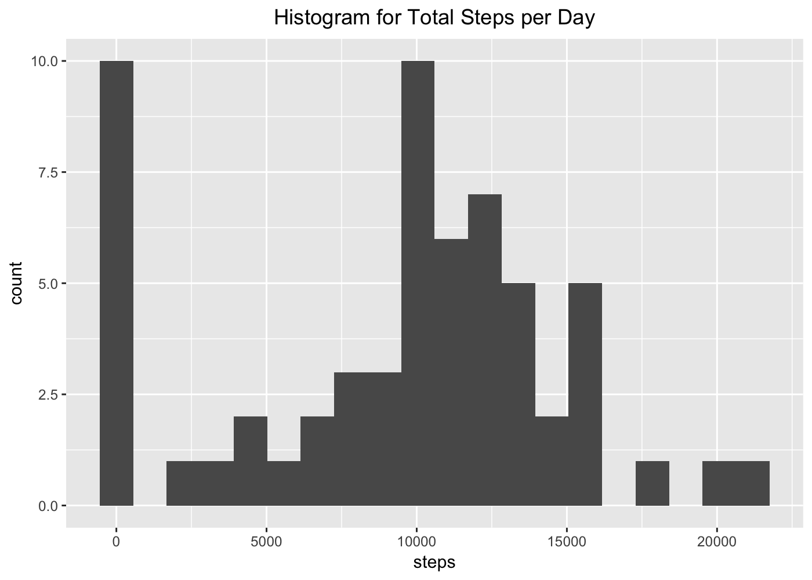
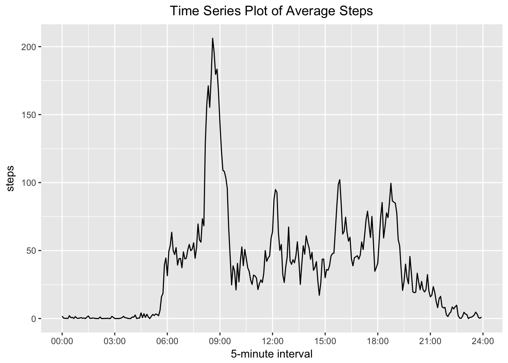
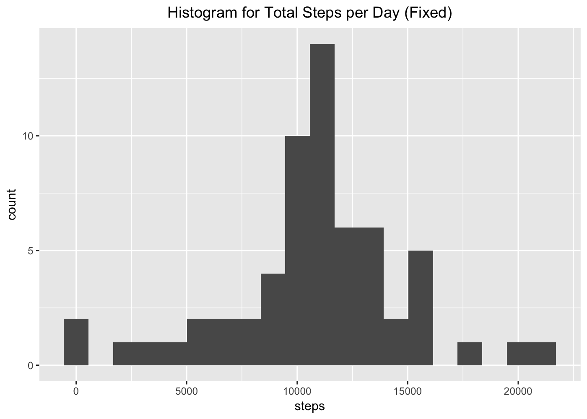

# Reproducible Research: Peer Assessment 1

## Setting global options

```r
library(knitr)
opts_chunk$set(echo = T, dpi = 200)
```

## Loading and preprocessing the data

### 1. Unzip activity.zip

```r
zipfile <- "activity.zip"
unzip(zipfile, exdir = ".")
datapath <- "activity.csv"
x <- 3
```

### 2. Load the data

```r
library(readr)
library(dplyr)
library(printr)
df <- read_csv(datapath)
head(df)
```


 steps  date          interval
------  -----------  ---------
    NA  2012-10-01           0
    NA  2012-10-01           5
    NA  2012-10-01          10
    NA  2012-10-01          15
    NA  2012-10-01          20
    NA  2012-10-01          25

## What is mean total number of steps taken per day?

### 1. Calculate the total number of steps per day

```r
daydf <- df %>%
  group_by(date) %>%
  summarise(steps = sum(steps, na.rm = T))
head(daydf)
```


date          steps
-----------  ------
2012-10-01        0
2012-10-02      126
2012-10-03    11352
2012-10-04    12116
2012-10-05    13294
2012-10-06    15420

### 2. Make a histogram for the total steps per day

```r
library(ggplot2)
ggplot(daydf, aes(steps)) +
  geom_histogram(bins = 20) +
  ggtitle("Histogram for Total Steps per Day") +
  theme(plot.title = element_text(hjust = 0.5))
```

<!-- -->

### 3. Calculate the mean and median of the total steps per day

```r
daydf %>%
  summarise(mean = mean(steps), median = median(steps))
```

    mean   median
--------  -------
 9354.23    10395

## What is the average daily activity pattern?

### 1. Calculate the average steps for each time interval

```r
timedf <- df %>%
  group_by(interval) %>%
  summarise(steps = mean(steps, na.rm = T))
head(timedf)
```


 interval       steps
---------  ----------
        0   1.7169811
        5   0.3396226
       10   0.1320755
       15   0.1509434
       20   0.0754717
       25   2.0943396

### 2. Make a time series plot

```r
ggplot(timedf, aes(x = interval, y = steps)) +
  geom_line() +
  ggtitle("Time Series Plot of Average Steps") +
  theme(plot.title = element_text(hjust = 0.5)) +
  xlab("5-minute interval") +
  scale_x_continuous(breaks = seq(0, 2400, 240), labels = function(x){
    formatC(x, width = 4, flag = "0", big.interval = 2, big.mark = ":")})
```

<!-- -->

### 3. Find the interval that contains the max average steps

```r
timedf %>% 
  top_n(n = 1)
```


 interval      steps
---------  ---------
      835   206.1698

## Imputing missing values

### 1. Calculate the total number of missing values in the dataset

```r
summarise_all(df, function(x){sum(is.na(x))})
```


 steps   date   interval
------  -----  ---------
  2304      0          0

Now, we can see that only the steps column has missing values. Therefore, there are **2304 rows with NAs** in the dataset.

### 2. Fill in all the missing values with mean for 5-minute interval

```r
fixeddf <- df %>%
  mutate(steps = 
           if_else(is.na(steps), timedf$steps[which(timedf$interval == interval)], as.double(steps)))
head(fixeddf, 10)
```

     steps  date          interval
----------  -----------  ---------
 1.7169811  2012-10-01           0
 0.3396226  2012-10-01           5
 0.1320755  2012-10-01          10
 0.1509434  2012-10-01          15
 0.0754717  2012-10-01          20
 2.0943396  2012-10-01          25
 0.5283019  2012-10-01          30
 0.8679245  2012-10-01          35
 0.0000000  2012-10-01          40
 1.4716981  2012-10-01          45

### 3. Calculate the total number of steps per day

```r
fixeddaydf <- fixeddf %>%
  group_by(date) %>%
  summarise(steps = sum(steps, na.rm = T))
head(fixeddaydf, 10)
```


date             steps
-----------  ---------
2012-10-01    10766.19
2012-10-02      126.00
2012-10-03    11352.00
2012-10-04    12116.00
2012-10-05    13294.00
2012-10-06    15420.00
2012-10-07    11015.00
2012-10-08        0.00
2012-10-09    12811.00
2012-10-10     9900.00

### 4. Make a histogram of total steps per day

```r
ggplot(fixeddaydf, aes(steps)) +
  geom_histogram(bins = 20) +
  ggtitle("Histogram for Total Steps per Day (Fixed)") +
  theme(plot.title = element_text(hjust = 0.5))
```

<!-- -->

### 3. Calculate the mean and median of the total steps per day

```r
fixeddaydf %>%
  summarise(mean = mean(steps), median = median(steps))
```

     mean   median
---------  -------
 9530.724    10439

The mean and median are **different from** the estimates from the first part of the assignment. The total daily numbers of steps of the days with missing values become **larger** after the missing data is imputed, while others remain the same.

## Are there differences in activity patterns between weekdays and weekends?
